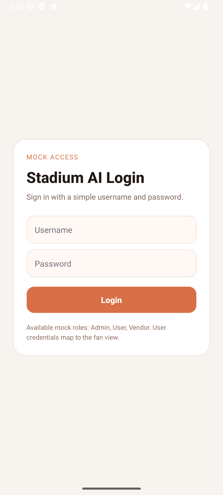
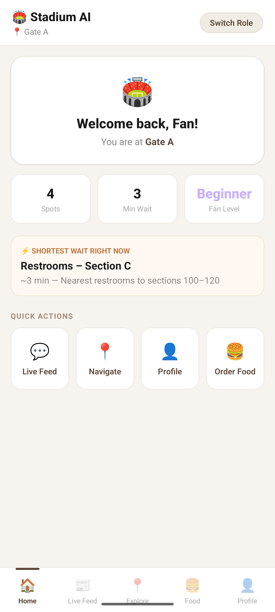
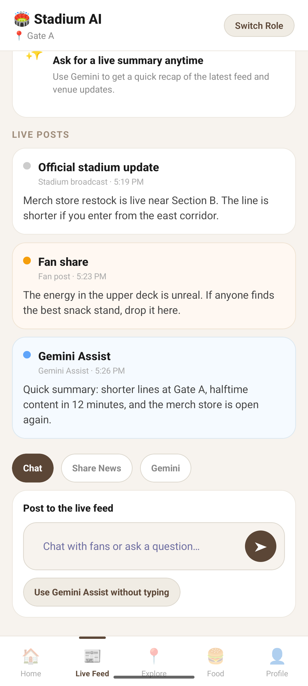
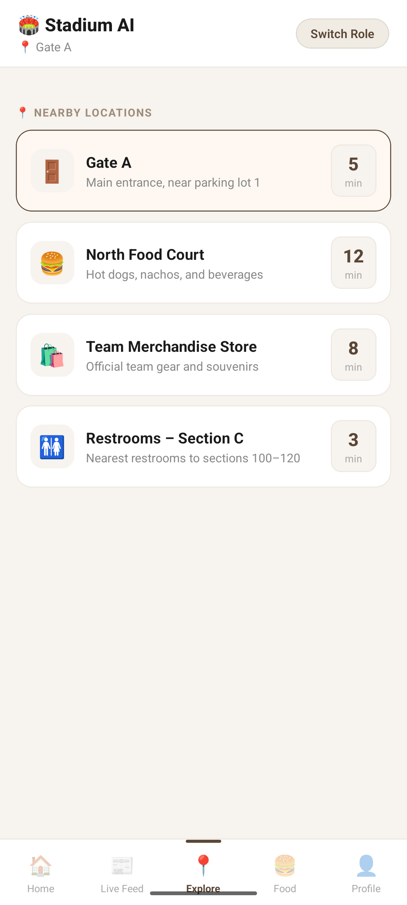
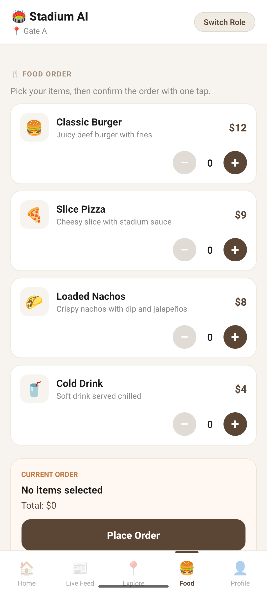
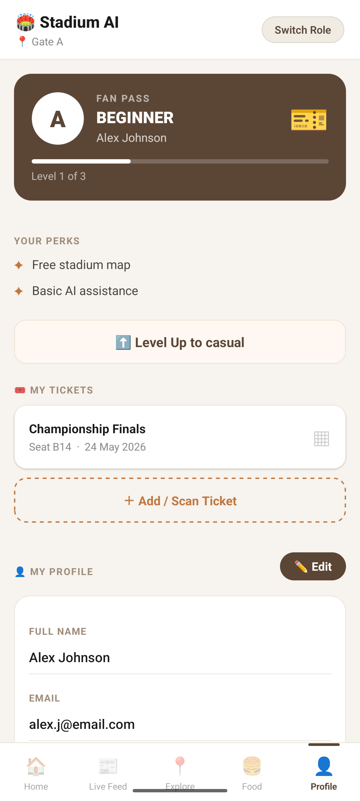
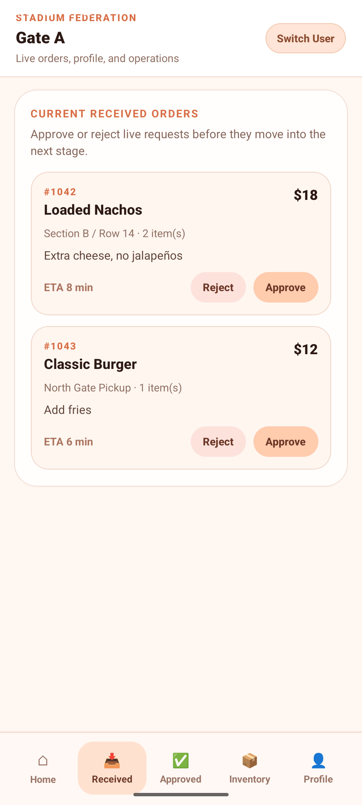
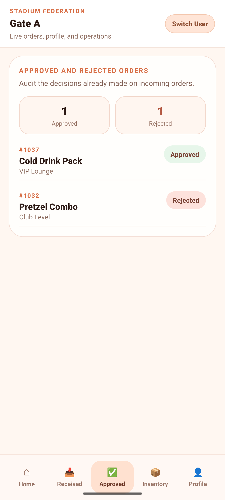

# Stadium AI

Stadium AI is a React Native mobile app for stadium operations and fan engagement. It combines three experiences in one codebase: a consumer app for fans, an admin control room for venue operations, and a vendor dashboard for orders, inventory, and team workflow.

The UI uses a warm stadium-themed palette, shared mock venue data, and role-based navigation to simulate a live event environment without a backend.

## What it does

- Fan experience with home, live feed, explore, food, and profile tabs.
- Admin operations with attendance, duty roster, zone control, messages, and crowd response.
- Vendor workflow with received orders, approvals, inventory restocking, processing, and profile controls.
- Shared stadium locations and wait times across all roles.
- Simple mock login for switching between consumer, admin, and vendor views.

## Tech Stack

- React Native 0.85.3
- React 19
- TypeScript
- react-native-safe-area-context
- lucide-react-native
- Jest for tests

## Project Structure

- App.tsx - top-level role switching and shared state.
- src/common/LoginScreen.tsx - mock login entry screen.
- src/views/consumer/ConsumerView.tsx - fan-facing experience.
- src/views/admin/AdminView.tsx - stadium operations dashboard.
- src/views/vendor/VendorView.tsx - vendor command center.
- src/types/index.ts - shared app types.
- mockStadium.json - seeded stadium locations and wait times.
- ScreenShots/ - exported app screenshots for documentation.

## Features by Role

### Consumer

- Browse stadium locations and live wait times.
- Switch between home, chat, explore, food, and pass screens.
- View live feed posts, announcements, and quick actions.
- Explore venue points of interest like gates, food courts, shops, and restrooms.

### Admin

- Monitor total attendance and overall stadium capacity.
- Review duty coverage and staff assignments.
- Read and send group operational messages.
- Inspect zone status, wait times, and queue pressure.
- Trigger wait-time adjustments for live crowd simulation.

### Vendor

- Review incoming orders and approve or reject them.
- Track processing orders and move the queue forward.
- Monitor inventory levels and restock low items.
- View team shifts, live status, and profile controls.
- Switch between overview, received, reviewed, inventory, and profile tabs.

## Screenshots

<table>
	<tr>
		<td align="center"></td>
		<td align="center"></td>
		<td align="center"></td>
		<td align="center"></td>
	</tr>
	<tr>
		<td align="center"></td>
		<td align="center"></td>
		<td align="center"></td>
		<td align="center"></td>
	</tr>
</table>

## Getting Started

### Prerequisites

- Node.js 22.11.0 or newer
- Android Studio or Xcode, depending on your target platform
- CocoaPods for iOS development

### Install dependencies

```sh
npm install
```

### Start Metro

```sh
npm start
```

### Run on Android

```sh
npm run android
```

### Run on iOS

Install native pods the first time, or after native dependency changes:

```sh
bundle install
bundle exec pod install
```

Then launch the app:

```sh
npm run ios
```

## Mock Login Credentials

- Admin: admin / admin
- Consumer: user / user
- Vendor: vendor / vendor

## Testing

```sh
npm test
```

## Notes

- This project is a UI-driven demo with shared mock data, not a backend-connected production system.
- Shared venue state lives in App.tsx, so switching roles keeps the same stadium data in sync.
- The screenshots in ScreenShots/ are ready to reuse in documentation, app store previews, or release notes.

## Learn More

- React Native documentation: https://reactnative.dev/docs/getting-started
- React Native CLI repository: https://github.com/react-native-community/cli
